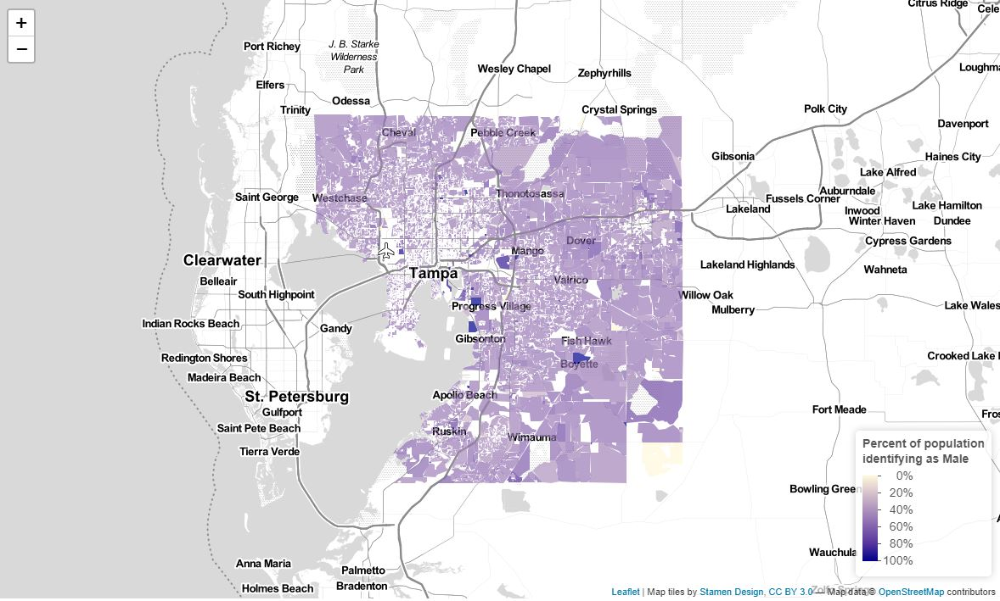
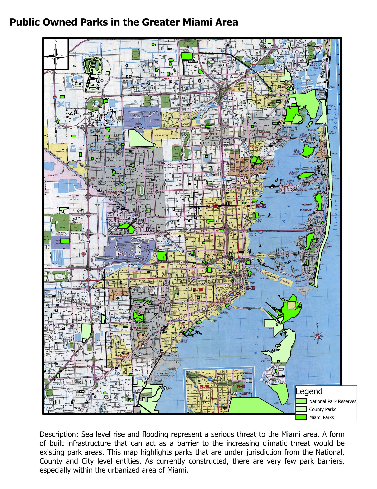
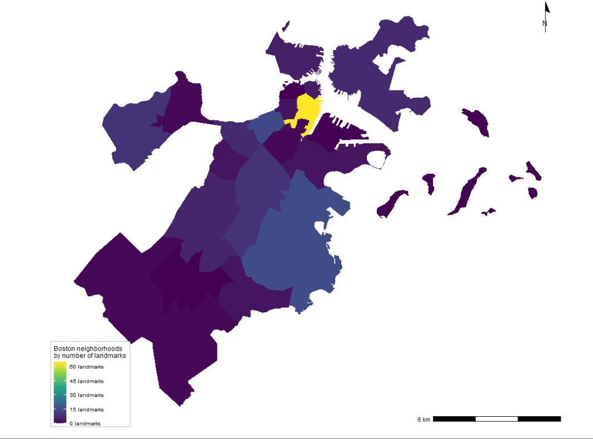
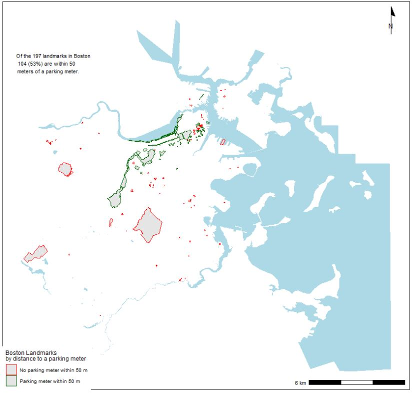
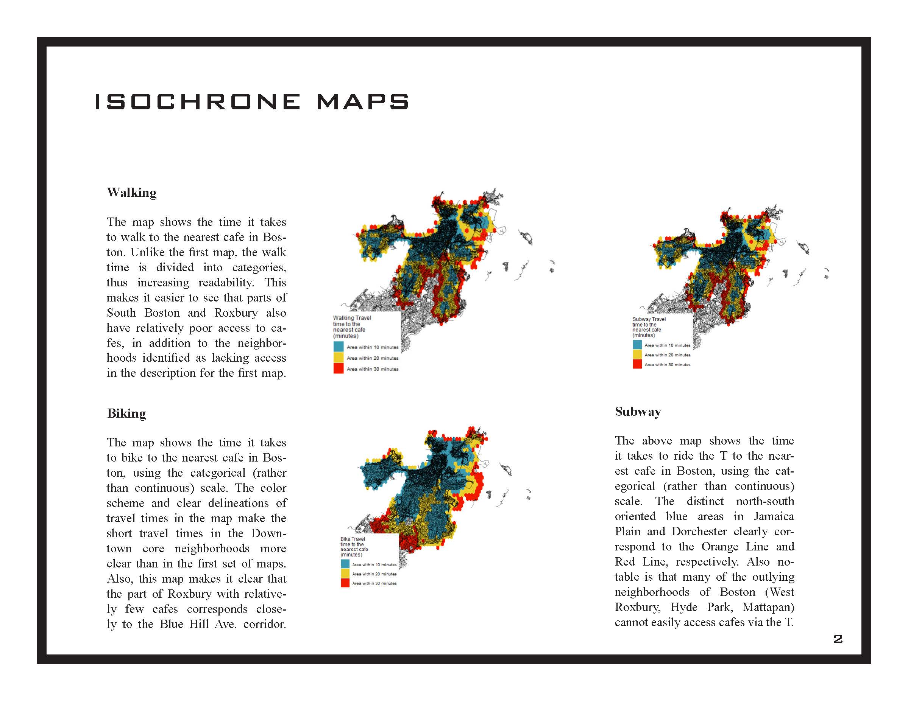
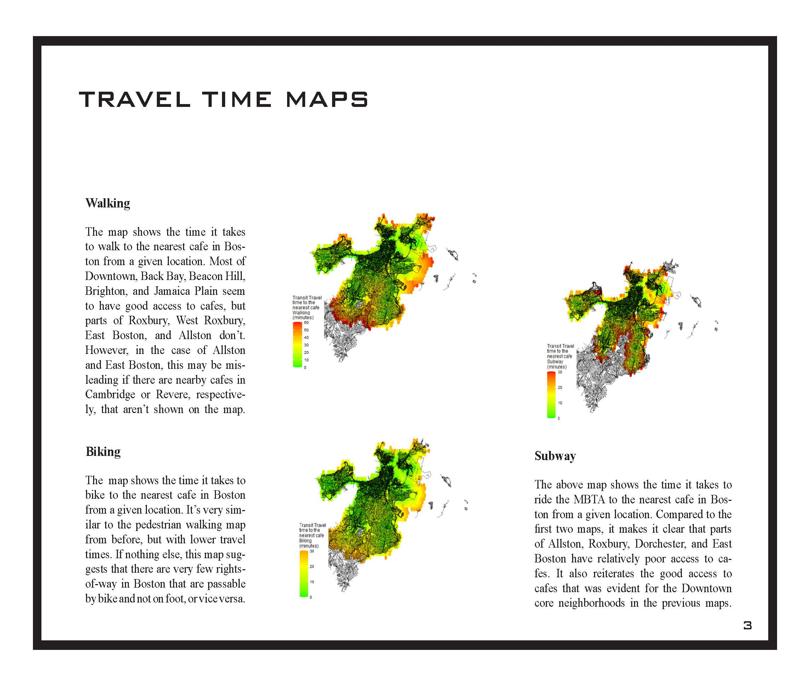
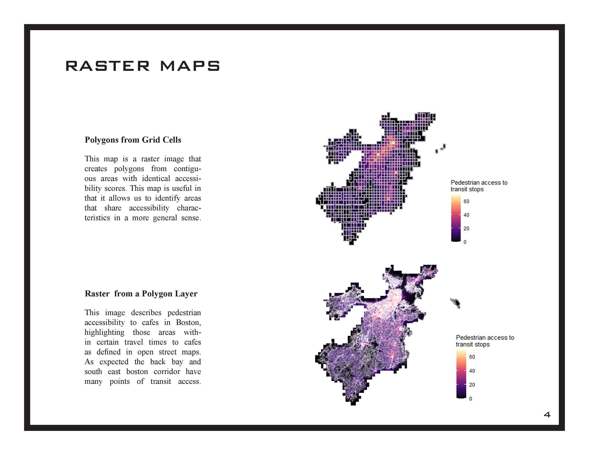

```{r setup, include=FALSE}
knitr::opts_chunk$set(echo = TRUE)
```
# Introduction

This is a culmination of mapping projects that have been completed throughout the VIS 2128 course. In this document you will find maps that demonstrate different r-studio skills that visually represent data. 


The following skills will be demonstrated in this portfolio.

* Displaying multiple vector layers on the same map
* Calculating and displaying relationships among point and polygon layers based on distance
* Aggregating point data to a layer of polygons
* Calculating and displaying accessibility, based on travel time
* Converting between raster layers and vector layers
* Displaying raster data on a map
* Georeferencing a raster image
* Displaying data on an interactive map

# Interactive Map
This interactive map of Tampa shows the male population spread across the city of Tampa. This map demonstrates the following skills: 

* Displaying data on an interactive map

[](https://cammccutchen.github.io/portfolio_1/fullsize/Tampa_Male_Population.html){target="_blank"}

# Georeferenced Map
The following map demonstrates a raster image that was georeferenced using Arc GIS. This map demonstrates the following skills: 

* Georeferencing a raster image

[](https://cammccutchen.github.io/portfolio_1/fullsize/Georeferenced_miami.pdf){target="_blank"}

# Distribution and Distance Maps
Let's take a look at maps based on the city of Boston!

## Boston Landmarks Distribution
In this map I aggregated landmark point data into a Boston neighborhood polygon layer to show the distributions of landmarks throughout neighborhoods within the city. This map demonstrates the following skills:

* Aggregating point data to a layer of polygons

[](https://cammccutchen.github.io/portfolio_1/thumbnails/Boston_landmarks.JPG){target="_blank"}

## Boston Landmarks Distance to Parking
If you are visiting a landmark, you might want to park near it. In this map we look at the relationship of landmarks to city parking. This map demonstrates the following skills:

* Calculating and displaying relationships among point and polygon layers based on distance

[](https://cammccutchen.github.io/portfolio_1/thumbnails/Landmarks_distance.JPG){target="_blank"}

# Time and Travel Relationship Maps
The following maps demonstrate the relationship of interacting with points in the city based upon time and distance. Each maps demonstrates a different way of seeingt this relationship. 

## Isochrones
This map shows Isochrones based on transit travel times to the nearest Boston cafe. It demonstrates the following skills:

* Displaying multiple vector layers on the same map
* Calculating and displaying accessibility, based on travel time

[](https://cammccutchen.github.io/portfolio_1/fullsize/Isochrone_maps.pdf){target="_blank"}

## Time Travel Matrix
This map shows a Time Travel Matrix based on transit travel times to the nearest Boston cafe. It demonstrates the following skills:

* Displaying multiple vector layers on the same map
* Calculating and displaying accessibility, based on travel time

[](https://cammccutchen.github.io/portfolio_1/fullsize/Travel_Time_Matrix.pdf){target="_blank"}

## Accessibility
This contour map shows accessibility by evaluating the walking time to the nearest Boston transit stop. It demonstrates the following skills:

* Displaying multiple vector layers on the same map
* Calculating and displaying accessibility, based on travel time
* Displaying raster data on a map

[](https://cammccutchen.github.io/portfolio_1/thumbnails/Raster_Maps.jpg){target="_blank"}
